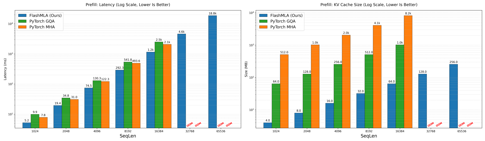
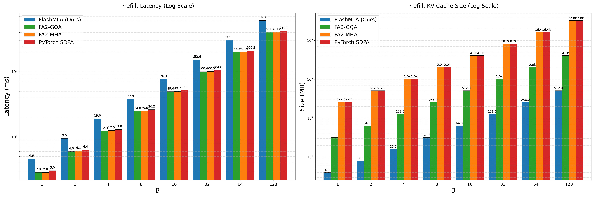
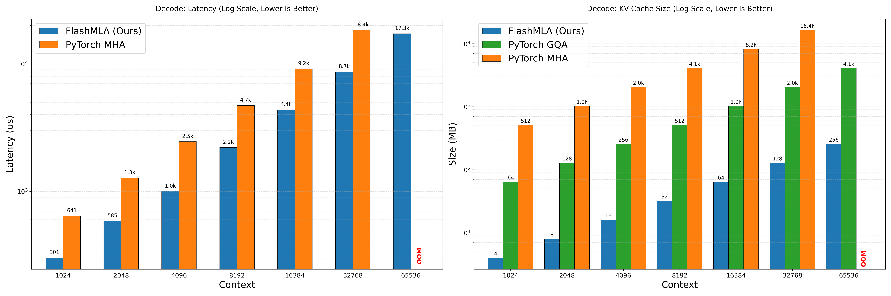
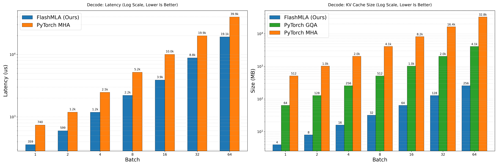

# FlashMLA: High-Performance Multi-Head Latent Attention Kernels

FlashMLA is an fast and memory-efficient collection of MLA (Multi-Head Latent Attention) kernels implemented in OpenAI Triton. Specifically optimized for the MLA architecture, it bridges the gap between massive context windows and hardware efficiency.

---
## Performance Benchmarks

Benchmarks were conducted on NVIDIA A100-SXM4-80GB.
Configuration: Heads=128, Dim=512 (DeepSeek V2/V3 Standard).

### Prefill Phase

#### Sequence Length Scaling (Batch = 4)

FlashMLA vs PyTorch MHA/GQA: While standard attention mechanisms suffer from OOM (Out Of Memory) at long contexts (16k+), FlashMLA maintains a negligible memory footprint, enabling significantly longer context windows.

#### Batch Size Scaling (Seq = 4096)

FlashMLA demonstrates robust throughput scaling with increasing batch sizes upto 64.

### Decode Phase

#### Context Length Scaling (Batch = 4)

FlashMLA vs PyTorch MHA: In the memory-bound decoding phase, FlashMLA leverages the shared-KV architecture to minimize HBM reads. It achieves microsecond-level latency that remains stable even at 64k context, while MHA/GQA suffer from linear latency growth and eventually OOM due to massive KV transfers.

#### Batch Size Scaling (Seq = 4096)

Even with increasing concurrency, FlashMLA maintains a significant speedup over standard implementations due to reduced memory bandwidth pressure.

---

## Key Features

* **FlashAttention Prefill**: Optimized tile-based kernel for the prefill stage, handling MLA’s absorbed projections with minimal overhead.
* **FlashDecoding (Split-KV)**: Accelerates the decoding phase by parallelizing over the sequence length, significantly reducing Time-To-First-Token (TTFT).
* **Matrix Absorption**: Fuses projection matrices into the attention computation, transforming compute-heavy operations into streamlined, memory-bound tasks.
* **Shared-KV Native**: Full support for MLA’s compressed KV latent vectors, reducing KV cache memory footprint by up to 90% compared to standard MHA.

---
