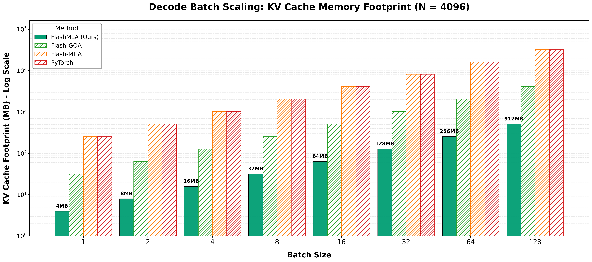
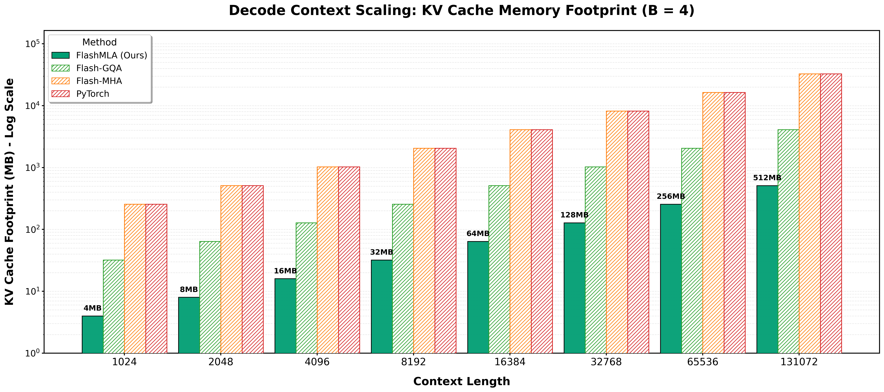

<h1>FlashMLA</h1>

<strong>High-Performance Multi-Head Latent Attention Kernels</strong>

FlashMLA is a high-performance kernel library specifically optimized for Multi-Head Latent Attention (MLA) architectures. Built on OpenAI Triton, it delivers state-of-the-art decoding performance for MLA-based models.

By leveraging MLA's compressed latent vectors, FlashMLA enables 8-64× smaller KV cache footprints compared to standard attention mechanisms while maintaining competitive throughput. It is designed for memory-bound scenarios where efficient cache management is critical.

> This repository hosts the standalone kernel primitives. For the end-to-end inference backend, please visit [vLLM_FlashMLA](https://github.com/Jayden-Xu/vllm_FlashMLA).

---
## Key Features

**Extreme Speed**: Highly optimized Triton kernels for MLA decoding.

**Memory Efficiency**: Native support for Compressed KV Latent vectors, drastically reducing memory usage compared to GQA/MHA.

**Zero-Overhead**: Fully compatible with CUDA Graph capture, ensuring minimal CPU overhead during execution.

**Production Ready**: Implements dynamic Split-K scheduling to automatically balance latency and throughput based on workload.

---

## Performance Benchmarks

Benchmarks were conducted on **NVIDIA A100-80GB** using **DeepSeek-V2-Lite-Chat** with **CUDA Graph enabled**.

### System-Level Performance

### Core Kernel Efficiency

We focus on the Memory Footprint for KV Cache during the decode phase to demonstrate the architectural advantage of MLA.

Key Architectural Parameters:
- FlashMLA: `d_c = 512` (Compressed KV Latent)
- MHA/GQA Baselines: `d_h = 128` (Standard Head Dimension)
- Attention Heads: `n_q_heads = 128`
- GQA Config: Group Size = 8 (`n_kv_heads = 16`)

---
